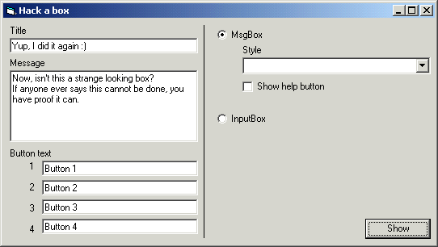

<div align="center">

## Hack a box


</div>

### Description

No, we are not going to do anything illegal here. We are going to hack the MsgBox and InputBox. Let me start by saying that this is !NOT! one of those custom messagebox classes, but this uses the real MsgBox and InputBox functions from VB.
 
### More Info
 


<span>             |<span>
---                |---
**Submitted On**   |2002-01-31 23:05:56
**By**             |[Networking\.be](https://github.com/Planet-Source-Code/PSCIndex/blob/master/ByAuthor/networking-be.md)
**Level**          |Advanced
**User Rating**    |4.7 (199 globes from 42 users)
**Compatibility**  |VB 5\.0, VB 6\.0
**Category**       |[Windows API Call/ Explanation](https://github.com/Planet-Source-Code/PSCIndex/blob/master/ByCategory/windows-api-call-explanation__1-39.md)
**World**          |[Visual Basic](https://github.com/Planet-Source-Code/PSCIndex/blob/master/ByWorld/visual-basic.md)
**Archive File**   |[Hack\_a\_box52208212002\.zip](https://github.com/Planet-Source-Code/networking-be-hack-a-box__1-31374/archive/master.zip)


### Source Code

```
If you ask someone the question "How to change the text of the buttons in a messagebox", the result would probably be that 99 times out of 100 you get the answer "I don't think that can be done". The other 1 time you probably asked me (or someone like me) and got the answer "Simple, just hook it".
<P>So how do you hook it? Simple, it only takes a few lines.
The hook will need to know a few things, first of all, where is the hook coming from? We can get that by making a call to GetWindowLong API function, specifying that we need the instance of our window.
<p>Another thing it needs to know is the thread that's calling it. For this we use the GetCurrentThreadID API.
<p>Finally we need to specify where it should send the messages to, and that would be a function we wrote. We now have everything to make the call. When calling, we specify that we are setting up a CBT hook, and off we go.
<p>After that, we can show our messagebox. This will send several messages to our function (in this case, 4 + the number of buttons), but we are only interested in the Activate, since this is when the messagebox is build completely. Our function must look like this (I called it Manipulate, since we are manipulating the box):
<p>Public Function Manipulate(ByVal lMsg As Long, <p>ByVal wParam As Long, ByVal lParam As Long) As Long
<p>We can disregard lParam, but lMsg contains the message and wParam will contain the hWnd of the message/inputbox.
<p>Once we have the hWnd, we can search for buttons. Since a button is actually a window of the class button, we can use the FindWindowEx API to find them. Once we have it, we can change the text using the SetWindowText API.
<p>After we done the processing, we need to release the hook. If we don't release the hook, our program can just disappear. With this I mean that it would be the same as just killing a process using the task manager, resulting is a possible loss of data, and a memory leak.
Also, when debugging, NEVER place a break between the place where you place your hook and release it, because this will probably result in the same effect as above.
<p>This can also be applied to the InputBox. The example code shows both.
The MSGBOX function will still return the selected value, so if you change the Yes button to "Yeah", it will still return vbYes (and not vbYeah ;)
<p>The INPUTBOX function returns the text entered, so basically nothing changes on the use, you just add a bit of a preparation.
<p>I think this code I wrote opens a new perspective. Since we are able to get the hWnd of the box and the buttons, we could easely use most of the WIndow APIs on it. This could maybe lead to custom shaped messageboxes, apply different window styles etc. Also, since we have a hWnd, we could get a hDC, which would allow us to use functions like BitBlt on it, and create boxes with pictures on the buttons rather than text. I haven't got time to test this, and I'm kinda busy lately, so if you manage to do anything cool with it, let me know.
<p>As usual, feedback and votes appriciated, and in this case expecially the feedback.
```

